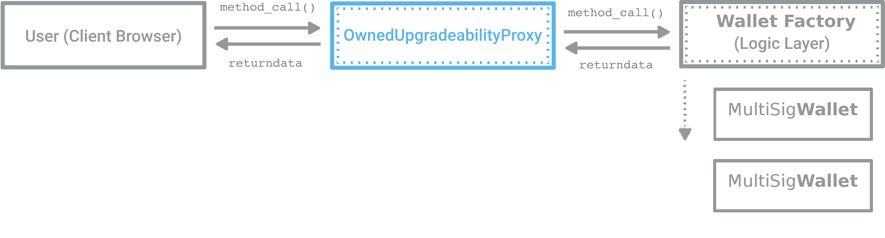

# LIGHTHOUSE

The Lighthouse dApp is a decentralized platform that enables access to a new generation of Identity. The application uses Ethereum Whisper as its principal communication layer. The identities and signers are managed on the EthrDID Registry.

The Id system uses a Proxy to redirect calls to the finall wallet factory.



### QR Code Arch


### Server


## Installation

### Requirements
* Unix system
* [Geth 1.8+](https://github.com/ethereum/go-ethereum/releases)
* [NodeJS/LTS](https://nodejs.org/en/download/package-manager/)
* [Truffle Framework 4.1.14+](https://truffleframework.com/truffle)
* [Ganache-cli](https://github.com/trufflesuite/ganache-cli)

```sh
(Terminal 1)$ npm install
(Terminal 1)$ truffle compile
```

## Usage

```sh
(Terminal 3)$ npm run geth-dev:whisper
(Terminal 2)$ npm run ganache-dev
(Terminal 1)$ truffle migrate --netwrok ganache_dev
(Terminal 1)$ npm start
```

### Ports
```
Ganache - rpc:8545, ws:8545
Geth - rpc:8545, ws:8546
```
```
App runs on http://localhost:3000
```


## Tests

```
$ truffle test --network ganache
```

## Contributing
Pull requests are welcome. For major changes, please open an issue first to discuss what you would like to change.

## License
[GNU AGPLv3](https://choosealicense.com/licenses/agpl-3.0/)
